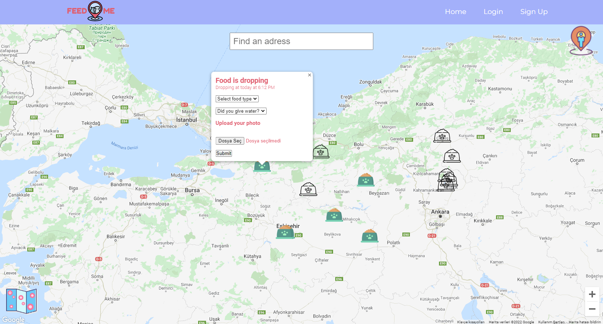

# Eskisehir Osmangazi University   
Thesis 2021

## Team Members

| Role                  | Name             |
|-----------------------|------------------|
| Full-Stack Developer  | Furkan Enes Eren |

## Project : `Feed Me`

Feed Me is a web application that holding the location data of stray animals.
Users choose the most proper location for them from the map in the application. Then they go to their designated location 
with the food they bought for stray animals. After users feed the stray animals, they mark the place that they went.
Also, if they want, they can upload a picture to the system as proof. 

|  |
| :--:|
| *Marker Form* |

## Before Start

In order to start the project, you will need `node` and `npm` installed on your machine.

### `cd feed-me`

First you need to go to feed-me directory: 

```shell
cd feeding stray animals
cd feed-me
```
After you enter the directory you need to install `@material-ui/core` and `@material-ui/icons` modules:

```shell
npm install @material-ui/core
npm install @material-ui/icons
```

### `npm start`

Runs the app in the development mode.\
Open [http://localhost:3000](http://localhost:3000) to view it in the browser.

The page will reload if you make edits.\
You will also see any lint errors in the console.

```shell
npm start
```