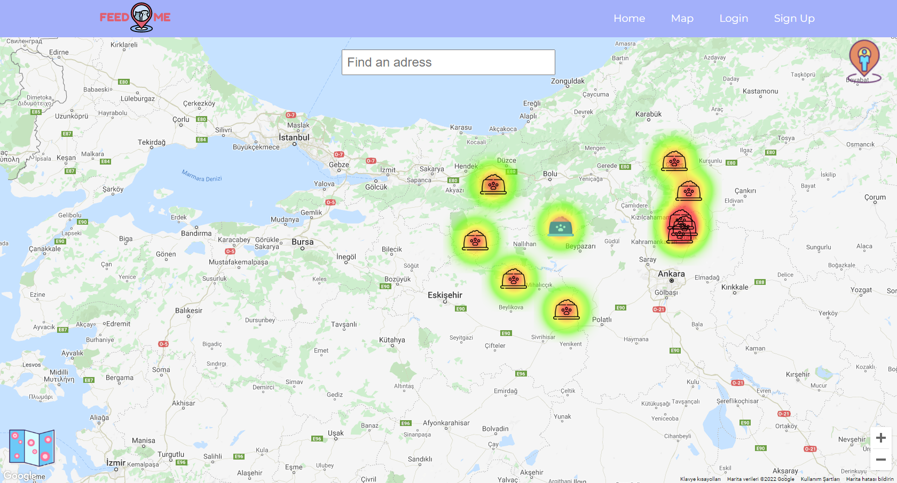
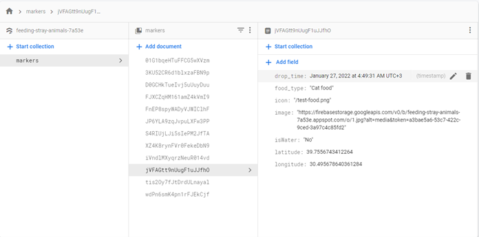

# Eskisehir Osmangazi University   
Thesis 2021

## Team Members

| Role                  | Name             |
|-----------------------|------------------|
| Full-Stack Developer  | Furkan Enes Eren |

## Project : `Feed Me`

Feed Me is a web application that holding the location data of dropped foods or pet foods for stray animals.
Users choose the most proper location for them from the map in the application. Then they go to their designated location 
with the food they bring for stray animals. After users dropped food for the stray animals, they mark the place that they went.
Also, if they want, they can upload a picture to the system as proof. 

When people using the application give food to street animals, they will mark the type of food, time and location on the map and share them with other people using the application. Thus, serving food at the same times in the same regions is prevented and food waste will be reduced. In addition, animal lovers will be able to see the regions on the map that are not given enough food and, if they wish, distribute food in these regions.

In development phase, in the begining NodeJS, Axios and MySQL is used for store user and marker informations. After that, for improvement, planned a serverless architecture with Google Firebase. Backend is moved to Firebase and storing data done in there (cloud). With firebase, user interactions with application is showing to other users immediately.

## Tech and Libraries

- ReactJS
- HTML
- Css
- Google Maps API
- Google Places
- MySQL
- NodeJS
- Firebase
- Axios
- Docker
- Postman


|  |
| :--:|
| *Marker Form* |

|  |
| :--:|
| *Marker Infobox* |

|  |
| :--:|
| *Markers with Heatmap* |

|  |
| :--:|
| *Firestore* |

|  |
| :--:|
| *NodeJS before Firebase* |

## Before Start

In order to start the project, you will need `node` and `npm` installed on your machine.

### `cd feed-me`

First you need to go to feed-me directory: 

```shell
cd feeding stray animals
cd feed-me
```
After you enter the directory you need to install `@material-ui/core` and `@material-ui/icons` modules:

```shell
npm install @material-ui/core
npm install @material-ui/icons
```

### `npm start`

Runs the app in the development mode.\
Open [http://localhost:3000](http://localhost:3000) to view it in the browser.

The page will reload if you make edits.\
You will also see any lint errors in the console.

```shell
npm start
```